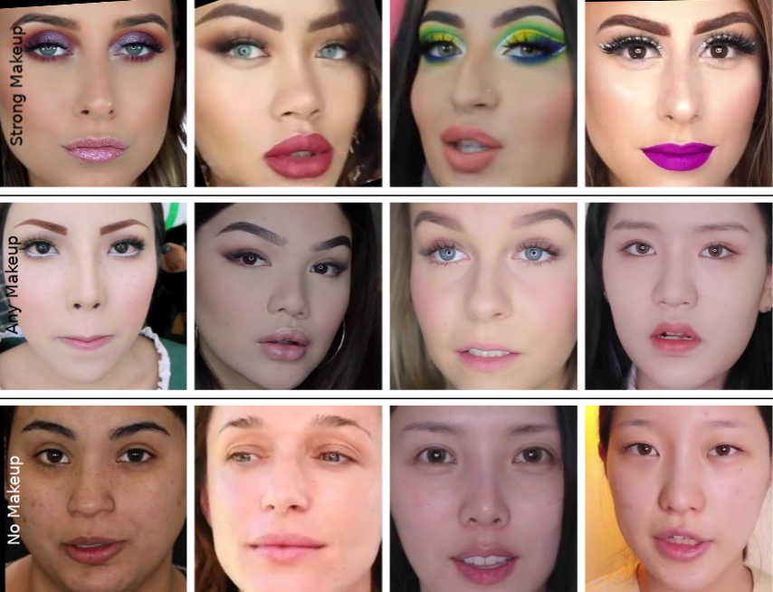
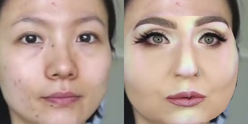

# Facial Cosmetic Content Dataset [FCC]



=====
The Facial Cosmetic Content [FCC] is a new (currently largest) dataset for makeup-style transfer/removal applications described in our paper [**Content and Colour Distillation for Learning Image Translations with the Spatial Profile Loss**](https://arxiv.org/pdf/1908.00274.pdf).

We gather a total of 18425 facial images containing strong, mild and no makeup images.  The dataset have the low resolution (256x256) and the high-resolution (512x512) subsets. It contains diverse makeup styles and includes various
races.

Because of the copyright issues, instead of sharing images we provide a script for the recreation of the FCC dataset by crawling the selected youtube videos. It might be the case that in the meantime some Videos used as sources for the dataset have been taken down. 

***[Disclaimer]***: The dataset (and the sample images shown here) are/should only be used for academic research. The copyright of the images resides with youtube/video-uploaders and we do not share them here.

| Dataset        | Subjects |Images per Subject | Images| Contains Before-and-After images            | Controlled Setting  |
| ------------- |:-------------:|:-------------:|:-------------:|:-------------:| -----:|
| [YMU](https://ieeexplore.ieee.org/document/6374605)      | 151 | 4 | 604|Y|N
| [VMU](https://ieeexplore.ieee.org/document/6374605)      | 51      |   4 | 204|Y|Y
| [MIW](https://ieeexplore.ieee.org/abstract/document/6612994) | 125      |    1-2 | 154|N|N
| [MIFS](https://ieeexplore.ieee.org/abstract/document/7947686) | 214      |    2 or 4 | 642|Y|Y
| [FAM](https://ieeexplore.ieee.org/document/6638073) | 519      |    2 | 1038|Y|N
| [MT](https://dl.acm.org/citation.cfm?id=3240618) | 3000+      |    1-2 | 3834|N|N
| [Our FCC](https://arxiv.org/pdf/1908.00274.pdf)| 440      |    2-125 | 18425|Y|N

## FCC Subsets

The FCC dataset consists of subsets containing Any-,Strong- and No-Makeup-Images in high and low resolution. 
 Due to the nature of various makeup tutorials, it includes before-and-after images of different subjects, which can be used to study face recognition under the appliance of makeup.
 We do not provide the explicit before-after image matchings between persons, however, they can be recovered based on matching image names as each image is named after the video url it stems from.
 
| Dataset   |   Images| 
| ------------- | -----:|
| [FCC](https://arxiv.org/pdf/1908.00274.pdf) |   18425  |
| &boxvr;&nbsp;  Strong Makeup ||
|&boxv;&boxvr;&nbsp; HR    |  1285  | 
|  &boxv;&boxvr;&nbsp;  LR |  5281  | 
|   &boxvr;&nbsp; Any Makeup ||
| &boxv;&boxvr;&nbsp; HR   |  3283  | 
|&boxv;&boxvr;&nbsp;  LR|  13036  |  
| &boxvr;&nbsp; No Makeup ||
 | &boxv;&boxvr;&nbsp; HR  |  1117  | 
| &boxv;&boxvr;&nbsp; LR |  5389  | 


## Dependencies
+ Python 3 
   * dlib
   * OpenCV 3 
   * pytube
+ ffmpeg

## Creating the Dataset
In order to recreate the dataset, we download the videos and extract the frames used initially to create the dataset. From these frames we extract the face crops and afterwards delete the downloaded videos and full frames. The final size of the dataset should be around ~ 600 MB. The initial directory for the dataset is './FacialCosmeticContent' and contains the three directories of no-, any- and strong Makeup in high and low resolution. In the case you want to store the dataset differently you need to change the fcc_path variable to your desired path.

```bash
python3 create_dataset.py
```

## Creating the Training/Testing Set for Makeup Transfer/Removal
The aligned training and testing sets are based on warping the landmarks of the reference faces onto the sources faces. 
You can specify #of pairs (source/reference) to generate for each source image.  
The resulting set consists of concatenations of an image of source image and the warped reference. As can be seen below:  


```bash
python3 create_aligned_set.py <Path of Set 1 (eg. ./FacialCosmeticContent/LR/AnyMakeup)> <Path of Set 2 (eg. ./FacialCosmeticContent/LR/NoMakeup)> <Desired Output Path> <number of pairs assigned to one face of Set 1> <desired Image Size> 
```


## Citation
If you use this work or dataset, please cite:
```latex
@inproceedings{spl,
    author    = {M. Saquib Sarfraz, Constantin Seibold , Haroon Khalid and Rainer Stiefelhagen}, 
    title     = {Content and Colour Distillation for Learning Image Translations with the Spatial Profile Loss}, 
    booktitle = {Proceedings of the 30th British Machine Vision Conference (BMVC)},
    year  = {2019}
}

```
