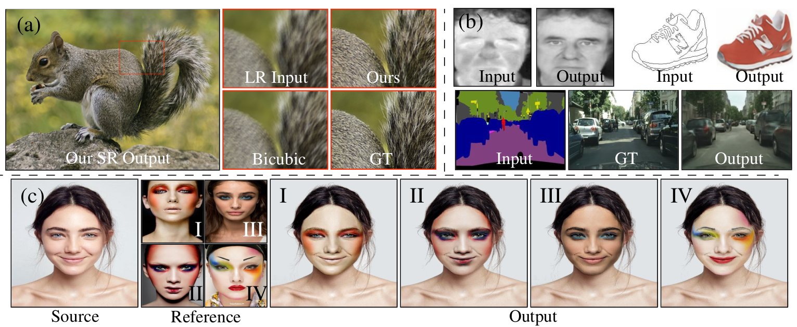

# Spatial Profile Loss for Image Translations


Spatial Profile Loss (SPL) is a novel pixel level loss to directly train single generators. The SPL loss can be seen as an effective replacement of the standard L1 loss on the generator. To motivate this, we have naturally trained standard generator networks without adversarial (discriminators) or perceptual networks/losses on different image translation problems.

The repository contains the code and the new make-up dataset (Facial Cosmetic Content (FCC)) described in our BMVC 2019 oral paper **Content and Colour Distillation for Learning Image Translations with the Spatial Profile Loss**. [https://arxiv.org/abs/1908.00274](https://arxiv.org/pdf/1908.00274.pdf) 

> [**Content and Colour Distillation for Learning Image Translations with the Spatial Profile Loss.**](https://arxiv.org/pdf/1908.00274.pdf)<br>
> M. Saquib Sarfraz, Constantin Seibold, Haroon Khalid, Rainer Stiefelhagen<br>
> 
>
> **Abstract:** *Generative adversarial networks has emerged as a defacto standard for image translation problems. To successfully drive such models, one has to rely on additional networks e.g., discriminators and/or perceptual networks. Training these networks with pixel based losses alone are generally not sufficient to learn the target distribution. In this paper, we propose a novel method of computing the loss directly between the source and target images that enable proper distillation of shape/content and colour/style.  We show that this is useful in typical image-to-image translations allowing us to successfully drive the generator without relying on additional networks.  We demonstrate this on many difficult image translation problems such as image-to-image domain mapping, single image super-resolution and photo realistic makeup transfer. Our extensive evaluation shows the effectiveness of the proposed formulation and its ability to synthesize realistic images.*

## Contents

Available material to out paper can be found here:

| Path | Description
| :--- | :----------
| [SPL](https://github.com/ssarfraz/SPL) | Main folder.
| &boxvr;&nbsp;[SPL_Loss](https://github.com/ssarfraz/SPL/SPL_Loss) | Contains the proposed loss formulation for both Tensorflow and Pytorch
| &boxvr;&nbsp;[FCC_Dataset](https://github.com/ssarfraz/SPL/FCC_Dataset) | Contains scripts for recreating the FCC dataset and data preparations for training/testing
| &boxvr;&nbsp;[Applications](https://github.com/ssarfraz/SPL/Tensorflow) | Contains Tensorflow implementation for image-to-image translation, single image Super Resolution and Makeup Transfer as described in our paper
| [Supplimentary](https://drive.google.com/file/d/1lkxO6lkzSClnGac2jcWuuBllMsAenETp/view?usp=sharing) | associated supplimentary notes (85.6 MB)


## Citation
If you use this work or dataset, please cite:
```latex
@inproceedings{spl,
    author    = {M. Saquib Sarfraz, Constantin Seibold , Haroon Khalid and Rainer Stiefelhagen}, 
    title     = {Content and Colour Distillation for Learning Image Translations with the Spatial Profile Loss}, 
    booktitle = {Proceedings of the 30th British Machine Vision Conference (BMVC)},
    year  = {2019}
}

```

